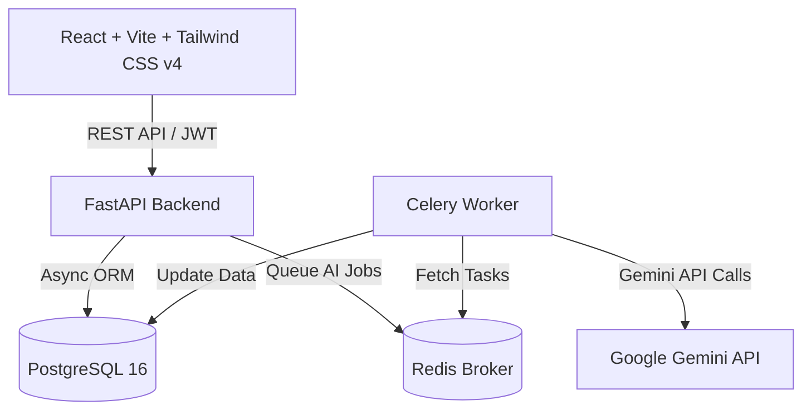

# Trackr — AI-Powered Project Management Tool

**Trackr** is an AI-augmented project management platform (Linear/Jira-style clone) featuring automated LLM-driven ticket triage, comment thread summarization, and sprint risk prediction.



---

## Key Features

- 🏢 **Workspaces & Projects**: Multi-user workspaces, project boards, and member roles (`admin` / `member`).
- 📋 **Kanban & Table Views**: Interactive Kanban workflow with drag-and-drop status columns (`todo`, `in_progress`, `in_review`, `done`), plus TanStack Table list view with column sorting and search filtering.
- 🤖 **AI Auto-Triage**: LLM background task reads ticket title & description to automatically assign labels (`frontend`, `bug`, `auth`, etc.), priority (`low`, `medium`, `high`, `urgent`), and story point estimates.
- 💬 **AI Comment Thread Summarizer**: Condenses long ticket discussion threads into a concise, action-oriented summary sentence.
- ⚡ **AI Sprint Risk Indicator**: Predicts sprint deadline risk (`low`, `medium`, `high`, `critical`) based on velocity, remaining story points, and days left, surfacing a visual glowing badge and LLM explanation.
- 🚀 **Demo Mode & Seed Script**: Instant one-click "Quick Demo Login" pre-populated with 45+ realistic tickets across active sprints.

---

## Tech Stack

| Layer | Technology |
|---|---|
| **Backend API** | FastAPI, Python 3.11+, Pydantic v2, PyJWT, Passlib/Bcrypt |
| **Database** | Async SQLAlchemy 2.0, PostgreSQL 16, asyncpg, Alembic |
| **Queue & Cache** | Redis 7 + Celery 5 |
| **AI Integration** | Google Gemini API (`gemini-1.5-flash`), `google-generativeai` SDK |
| **Frontend** | React 19, Vite, Tailwind CSS v4, TanStack Table v8, Framer Motion, Lucide Icons |
| **Containers** | Docker & Docker Compose |

---

## Quick Start (Docker Compose)

1. **Clone the repository**:
   ```bash
   git clone https://github.com/Ramyprojs/Trackr.git
   cd Trackr
   ```

2. **Configure Environment**:
   ```bash
   cp .env.example .env
   ```
   *(Optional: Add your `GEMINI_API_KEY` in `.env` to use live LLM calls. If omitted, smart heuristic fallback AI mode runs automatically).*

3. **Start the Stack**:
   ```bash
   docker-compose up --build
   ```

4. **Open the Apps**:
   - **Frontend App:** [http://localhost:3000](http://localhost:3000)
   - **API Docs (Swagger):** [http://localhost:8000/docs](http://localhost:8000/docs)
   - **API Health:** [http://localhost:8000/api/v1/health](http://localhost:8000/api/v1/health)
   - **Celery Worker Health:** [http://localhost:8000/api/v1/health/worker](http://localhost:8000/api/v1/health/worker)

---

## Running Backend Unit Tests

```bash
cd backend
pip install -r requirements.txt
pytest
```

---

## Final Deliverable Checklist
- [x] `docker-compose up` boots full stack cleanly
- [x] JWT Signup → Workspace Creation → Project Creation → Ticket Creation
- [x] Celery background worker + Redis job queue connected
- [x] Gemini AI triage, comment summarization, and sprint risk scoring
- [x] High-craft React Kanban Board and TanStack Table UI
- [x] Demo mode login button pre-seeded with ~50 realistic tickets
- [x] No secrets committed; `.env.example` provided

---
*Built with Google Antigravity & Gemini 3.6 Flash.*
