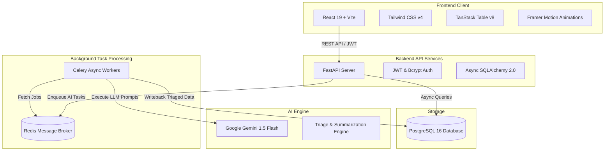

# Trackr Architecture Documentation

Trackr is an AI-augmented project management tool built with FastAPI, Async SQLAlchemy, PostgreSQL, Celery, Redis, Google Gemini API, React 19, and Tailwind CSS v4.

## System Components

1. **FastAPI Application (`/backend/app`)**:
   - Handles REST API requests, authentication, and database sessions.
   - Enforces role-based permissions (Workspace Admin vs Member).

2. **Async Database Layer (`/backend/app/models`)**:
   - Asynchronous PostgreSQL interaction via `asyncpg` and SQLAlchemy 2.0.
   - Models: `User`, `Workspace`, `WorkspaceMember`, `Project`, `Board`, `Sprint`, `Ticket`, `Comment`.

3. **Background Job Queue (`/backend/app/tasks.py`)**:
   - Celery worker connected to Redis message broker.
   - Handles asynchronous AI ticket triage, comment thread summarization, and sprint risk scoring without blocking API responses.

4. **Gemini AI Integration (`/backend/app/ai/service.py`)**:
   - Abstract service wrapping Google Gemini API.
   - Predicts labels, priority, and story points; generates comment summaries; and computes sprint risk explanations.

5. **Frontend Client (`/frontend`)**:
   - High-craft UI built with React, Vite, and Tailwind CSS v4.
   - Features animated Kanban workflow, TanStack Table list view, interactive ticket drawers, and visual AI Risk indicators.
